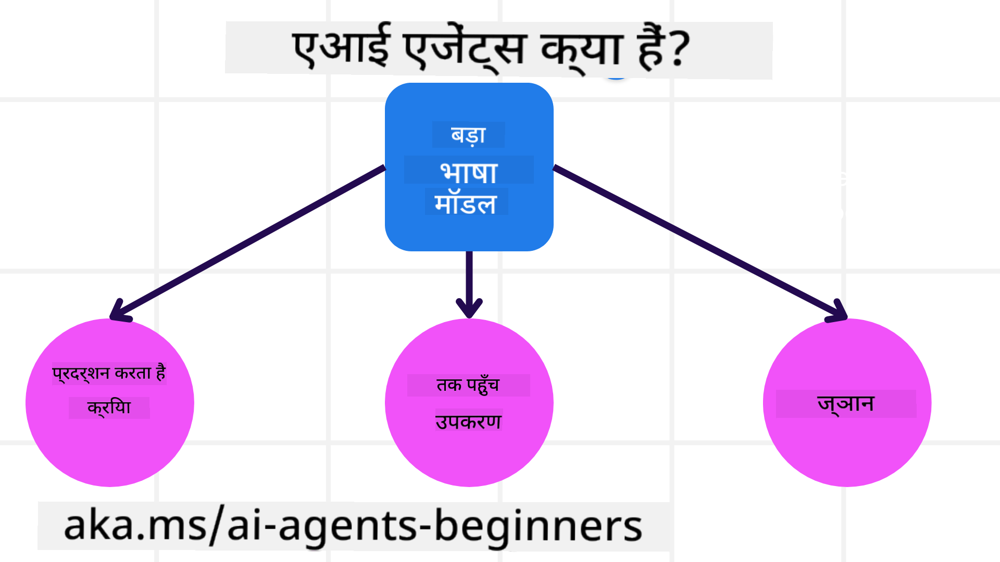
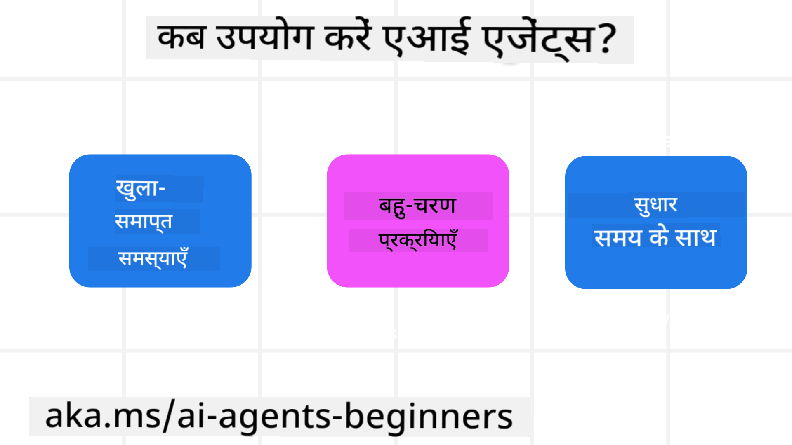

<!--
CO_OP_TRANSLATOR_METADATA:
{
  "original_hash": "d84943abc8f001ad4670418d32c2d899",
  "translation_date": "2025-05-20T09:41:06+00:00",
  "source_file": "01-intro-to-ai-agents/README.md",
  "language_code": "hi"
}
-->
अन्य शिक्षार्थियों और AI एजेंट बिल्डर्स से मिलने और इस कोर्स के बारे में अपने सवाल पूछने के लिए जुड़ें।

इस कोर्स की शुरुआत में, हम यह समझेंगे कि AI एजेंट क्या होते हैं और हम उन्हें अपने बनाए गए एप्लिकेशन और वर्कफ़्लो में कैसे उपयोग कर सकते हैं।

## परिचय

यह पाठ निम्नलिखित विषयों को कवर करता है:

- AI एजेंट क्या होते हैं और एजेंट के विभिन्न प्रकार क्या हैं?
- AI एजेंट के लिए कौन से उपयोग मामले सबसे उपयुक्त हैं और वे हमारी कैसे मदद कर सकते हैं?
- एजेंटिक समाधान डिज़ाइन करते समय कुछ बुनियादी घटक क्या होते हैं?

## सीखने के लक्ष्य
इस पाठ को पूरा करने के बाद, आप सक्षम होंगे:

- AI एजेंट की अवधारणाओं को समझना और यह कि वे अन्य AI समाधानों से कैसे भिन्न होते हैं।
- AI एजेंट का सबसे प्रभावी ढंग से उपयोग करना।
- उपयोगकर्ताओं और ग्राहकों दोनों के लिए उत्पादक रूप से एजेंटिक समाधान डिज़ाइन करना।

## AI एजेंट की परिभाषा और AI एजेंट के प्रकार

### AI एजेंट क्या हैं?

AI एजेंट ऐसे **सिस्टम** होते हैं जो **लार्ज लैंग्वेज मॉडल्स (LLMs)** को **कार्रवाइयां करने** में सक्षम बनाते हैं, उनकी क्षमताओं का विस्तार करते हुए LLMs को **उपकरणों** और **ज्ञान** तक पहुंच प्रदान करते हैं।

आइए इस परिभाषा को छोटे हिस्सों में समझें:

- **सिस्टम** - एजेंट को केवल एक घटक के रूप में नहीं, बल्कि कई घटकों के सिस्टम के रूप में देखना जरूरी है। एक AI एजेंट के मूलभूत घटक हैं:
  - **पर्यावरण (Environment)** - वह परिभाषित क्षेत्र जहाँ AI एजेंट काम कर रहा होता है। उदाहरण के लिए, यदि हमारे पास एक ट्रैवल बुकिंग AI एजेंट है, तो पर्यावरण वह ट्रैवल बुकिंग सिस्टम हो सकता है जिसका उपयोग एजेंट कार्य पूरा करने के लिए करता है।
  - **सेंसर (Sensors)** - पर्यावरण में जानकारी होती है और वह प्रतिक्रिया प्रदान करता है। AI एजेंट इस जानकारी को इकट्ठा करने और व्याख्या करने के लिए सेंसर का उपयोग करता है। ट्रैवल बुकिंग एजेंट के उदाहरण में, ट्रैवल बुकिंग सिस्टम होटल उपलब्धता या फ्लाइट की कीमतों जैसी जानकारी दे सकता है।
  - **एक्चुएटर्स (Actuators)** - जब AI एजेंट को पर्यावरण की वर्तमान स्थिति मिल जाती है, तो वह तय करता है कि पर्यावरण को बदलने के लिए कौन सी कार्रवाई करनी है। ट्रैवल बुकिंग एजेंट के लिए, यह उपयोगकर्ता के लिए उपलब्ध कमरे को बुक करना हो सकता है।

**लार्ज लैंग्वेज मॉडल्स** - एजेंटों की अवधारणा LLMs के बनने से पहले भी थी। LLMs के साथ AI एजेंट बनाने का फायदा यह है कि वे मानव भाषा और डेटा को समझ सकते हैं। यह क्षमता LLMs को पर्यावरणीय जानकारी को समझने और पर्यावरण बदलने की योजना बनाने में सक्षम बनाती है।

**कार्रवाइयां करना** - AI एजेंट सिस्टम के बाहर, LLMs केवल तब सीमित होते हैं जब कार्रवाई उपयोगकर्ता के संकेत के आधार पर सामग्री या जानकारी उत्पन्न करना होती है। AI एजेंट सिस्टम के अंदर, LLMs उपयोगकर्ता की रिक्वेस्ट को समझकर और उपलब्ध उपकरणों का उपयोग करके कार्य पूरा कर सकते हैं।

**उपकरणों तक पहुंच** - LLM को कौन से उपकरण उपलब्ध हैं, यह परिभाषित होता है 1) उस पर्यावरण द्वारा जिसमें वह काम कर रहा है और 2) AI एजेंट के डेवलपर द्वारा। हमारे ट्रैवल एजेंट उदाहरण में, एजेंट के उपकरण बुकिंग सिस्टम में उपलब्ध ऑपरेशन्स तक सीमित हैं, और/या डेवलपर एजेंट के उपकरणों को फ्लाइट तक सीमित कर सकता है।

**मेमोरी+ज्ञान** - मेमोरी बातचीत के संदर्भ में अल्पकालिक हो सकती है। दीर्घकालिक रूप से, पर्यावरण से प्राप्त जानकारी के अलावा, AI एजेंट अन्य सिस्टम, सेवाओं, उपकरणों और यहां तक कि अन्य एजेंटों से भी ज्ञान प्राप्त कर सकते हैं। ट्रैवल एजेंट उदाहरण में, यह ज्ञान उपयोगकर्ता की यात्रा प्राथमिकताओं की जानकारी हो सकती है जो ग्राहक डेटाबेस में हो।

### एजेंटों के विभिन्न प्रकार

अब जब हमारे पास AI एजेंट की सामान्य परिभाषा है, तो आइए कुछ विशिष्ट एजेंट प्रकारों को देखें और वे ट्रैवल बुकिंग AI एजेंट पर कैसे लागू होंगे।

| **एजेंट प्रकार**              | **विवरण**                                                                                                                             | **उदाहरण**                                                                                                                                                                                                                   |
| ----------------------------- | ------------------------------------------------------------------------------------------------------------------------------------- | ----------------------------------------------------------------------------------------------------------------------------------------------------------------------------------------------------------------------------- |
| **सरल रिफ्लेक्स एजेंट्स**      | पूर्वनिर्धारित नियमों के आधार पर तुरंत कार्रवाई करते हैं।                                                                             | ट्रैवल एजेंट ईमेल के संदर्भ को समझता है और यात्रा शिकायतों को ग्राहक सेवा को भेजता है।                                                                                                                                      |
| **मॉडल-आधारित रिफ्लेक्स एजेंट्स** | दुनिया के मॉडल और उसके परिवर्तनों के आधार पर कार्रवाई करते हैं।                                                                       | ट्रैवल एजेंट ऐतिहासिक मूल्य डेटा के आधार पर महत्वपूर्ण मूल्य परिवर्तनों वाले मार्गों को प्राथमिकता देता है।                                                                                                             |
| **लक्ष्य-आधारित एजेंट्स**       | विशिष्ट लक्ष्यों को प्राप्त करने के लिए योजना बनाते हैं और उन लक्ष्यों तक पहुंचने के लिए कार्रवाई निर्धारित करते हैं।                   | ट्रैवल एजेंट आवश्यक यात्रा व्यवस्थाओं (कार, सार्वजनिक परिवहन, फ्लाइट) को निर्धारित करके यात्रा बुक करता है।                                                                                                                      |
| **उपयोगिता-आधारित एजेंट्स**    | प्राथमिकताओं पर विचार करते हैं और लक्ष्यों को प्राप्त करने के लिए व्यापारिक समझौतों को संख्यात्मक रूप से तौलते हैं।                      | ट्रैवल एजेंट यात्रा बुक करते समय सुविधा और लागत के बीच संतुलन बनाकर उपयोगिता को अधिकतम करता है।                                                                                                                              |
| **लर्निंग एजेंट्स**             | प्रतिक्रिया के आधार पर समय के साथ सुधार करते हैं और तदनुसार कार्रवाई समायोजित करते हैं।                                              | ट्रैवल एजेंट यात्रा के बाद सर्वेक्षणों से ग्राहक प्रतिक्रिया का उपयोग करके भविष्य की बुकिंग में सुधार करता है।                                                                                                               |
| **हाइरार्किकल एजेंट्स**        | कई एजेंटों को स्तरित प्रणाली में शामिल करते हैं, जहां उच्च-स्तरीय एजेंट कार्यों को निम्न-स्तरीय एजेंटों के लिए उपकार्य में विभाजित करते हैं। | ट्रैवल एजेंट यात्रा रद्द करने का कार्य उपकार्य (जैसे, विशिष्ट बुकिंग रद्द करना) में बांटता है और निम्न-स्तरीय एजेंट उन्हें पूरा करते हैं, फिर उच्च-स्तरीय एजेंट को रिपोर्ट करते हैं।                                              |
| **मल्टी-एजेंट सिस्टम्स (MAS)** | एजेंट स्वतंत्र रूप से कार्य पूरा करते हैं, सहकारी या प्रतिस्पर्धात्मक रूप से।                                                         | सहकारी: कई एजेंट विशिष्ट यात्रा सेवाएं जैसे होटल, फ्लाइट, और मनोरंजन बुक करते हैं। प्रतिस्पर्धात्मक: कई एजेंट एक साझा होटल बुकिंग कैलेंडर पर प्रबंधन और प्रतिस्पर्धा करते हैं ताकि ग्राहकों को होटल में बुक किया जा सके। |

## AI एजेंट कब उपयोग करें

पिछले खंड में, हमने ट्रैवल एजेंट उपयोग-मामले का उपयोग करके दिखाया कि विभिन्न प्रकार के एजेंट ट्रैवल बुकिंग के अलग-अलग परिदृश्यों में कैसे उपयोग किए जा सकते हैं। हम इस एप्लिकेशन का पूरे कोर्स में उपयोग करेंगे।

आइए देखें कि AI एजेंट के लिए कौन से उपयोग मामले सबसे उपयुक्त हैं:

- **खुले अंत वाले समस्याएं** - LLM को कार्य पूरा करने के लिए आवश्यक कदम निर्धारित करने देना क्योंकि इसे हमेशा वर्कफ़्लो में हार्डकोड नहीं किया जा सकता।
- **बहु-चरण प्रक्रियाएं** - ऐसे कार्य जिनमें जटिलता का स्तर होता है और AI एजेंट को कई चरणों में उपकरण या जानकारी का उपयोग करना पड़ता है, न कि एक बार में।
- **समय के साथ सुधार** - ऐसे कार्य जहां एजेंट समय के साथ बेहतर उपयोगिता प्रदान करने के लिए अपने पर्यावरण या उपयोगकर्ताओं से प्रतिक्रिया प्राप्त करके सुधार कर सकता है।

हम AI एजेंट का उपयोग करते समय और विचारों को "Building Trustworthy AI Agents" पाठ में कवर करते हैं।

## एजेंटिक समाधान के मूल बातें

### एजेंट विकास

AI एजेंट सिस्टम डिज़ाइन करने का पहला कदम उपकरणों, कार्रवाइयों, और व्यवहारों को परिभाषित करना है। इस कोर्स में, हम **Azure AI Agent Service** का उपयोग करके अपने एजेंट को परिभाषित करने पर ध्यान केंद्रित करते हैं। यह निम्नलिखित सुविधाएं प्रदान करता है:

- OpenAI, Mistral, और Llama जैसे खुले मॉडल का चयन
- Tripadvisor जैसे प्रदाताओं के माध्यम से लाइसेंस प्राप्त डेटा का उपयोग
- मानकीकृत OpenAPI 3.0 उपकरणों का उपयोग

### एजेंटिक पैटर्न

LLMs के साथ संवाद प्रॉम्प्ट के माध्यम से होता है। AI एजेंट की आंशिक स्वायत्त प्रकृति के कारण, पर्यावरण में बदलाव के बाद LLM को मैन्युअल रूप से फिर से प्रॉम्प्ट करना हमेशा संभव या आवश्यक नहीं होता। हम **एजेंटिक पैटर्न** का उपयोग करते हैं जो हमें कई चरणों में LLM को अधिक स्केलेबल तरीके से प्रॉम्प्ट करने की अनुमति देते हैं।

यह कोर्स वर्तमान लोकप्रिय एजेंटिक पैटर्न में विभाजित है।

### एजेंटिक फ्रेमवर्क्स

एजेंटिक फ्रेमवर्क डेवलपर्स को कोड के माध्यम से एजेंटिक पैटर्न लागू करने देते हैं। ये फ्रेमवर्क टेम्पलेट्स, प्लगइन्स, और उपकरण प्रदान करते हैं जो बेहतर AI एजेंट सहयोग के लिए सहायक होते हैं। ये लाभ AI एजेंट सिस्टम की बेहतर निगरानी और समस्या निवारण की क्षमता प्रदान करते हैं।

इस कोर्स में, हम अनुसंधान-आधारित AutoGen फ्रेमवर्क और उत्पादन-तैयार Semantic Kernel के Agent फ्रेमवर्क का अन्वेषण करेंगे।

## पिछला पाठ

[Course Setup](../00-course-setup/README.md)

## अगला पाठ

[Exploring Agentic Frameworks](../02-explore-agentic-frameworks/README.md)

**अस्वीकरण**:  
यह दस्तावेज़ AI अनुवाद सेवा [Co-op Translator](https://github.com/Azure/co-op-translator) का उपयोग करके अनुवादित किया गया है। हम सटीकता के लिए प्रयासरत हैं, लेकिन कृपया ध्यान दें कि स्वचालित अनुवादों में त्रुटियाँ या असंगतियाँ हो सकती हैं। मूल दस्तावेज़ अपनी मूल भाषा में ही प्रामाणिक स्रोत माना जाना चाहिए। महत्वपूर्ण जानकारी के लिए, पेशेवर मानव अनुवाद की सिफारिश की जाती है। इस अनुवाद के उपयोग से उत्पन्न किसी भी गलतफहमी या गलत व्याख्या के लिए हम जिम्मेदार नहीं हैं।